# DS221 (Sep 2025) Assignment 1

## Total Points: 20

* **Posted on 25-08-2025**
* **Due on 20-09-2025 11:59 PM** (No extension will be granted)
-----------------------------------------------------------------------------------------------------------------------

## PROBLEM CONTEXT

You are working as a software engineer for a parcel delivery company. The company handles parcels, trucks, delivery routes, and customer requests daily. Your job is to write efficient algorithms to manage these operations.

## QUESTIONS
-----------------------------------------------------------------------------------------------------------------------

### Q1.
You are given a list of parcels, where each parcel is represented by its ID and weight. Some parcels may appear more than once in the list (i.e., duplicate IDs). Two parcels with the same parcel ID but different weights should be considered duplicates.  

Your task is to detect all duplicate parcels and return the minimum weight occurrence of each duplicate parcel in sorted order of ids in the specified output format.  

-----------------------------------------------------------------------------------------------------------------------

### Q2.
The logistics division of the company has designed an automated parcel routing system. The system is modeled as a binary conveyor network:  
- Each junction is represented as a node. A junction splits into two belts, sending parcels either left or right.  
- The topmost junction is numbered 0 and is known as the root junction.  
- Junctions are numbered in level-order traversal (from top to bottom, left to right).  
- Parcels are eventually routed to loading junctions (leaf nodes). From there, they are sent to trucks bound for different destinations.  

At any given time, the company tracks:  
- A mapping of parcels to loading junctions.  
- A query list of parcels, which contains the parcel IDs that got damaged.  

The inspection team wants to find the highest-numbered junction ID on which all the items in the query list were present.  
The inspection team has received **k** query lists and wants to find the junctions for each query list efficiently.  
Your goal is to help the inspection team.  

A query list contains parcel IDs that must all be gathered together for a special inspection.  
To perform this inspection efficiently, the company doesn’t need to physically bring all parcels to a single location. Instead, the inspection can be carried out at the highest possible junction (i.e., the junction with the largest index in level order) that still has all the parcels in the query.  

#### Input 
- A binary tree representing the conveyor network.  
- A mapping of parcels currently present at each loading junction.  
- **k** query lists of parcel IDs for inspection.  

#### Output  
Return the highest-numbered junction ID (i.e., junction with the largest index in level order) for each query list such that all the items of the list are present on that junction.  

-----------------------------------------------------------------------------------------------------------------

### Q3.

A logistics company operates warehouses in several cities across the country. The country’s road map can be represented as a weighted graph:  
- Each city is a node (numbered 1 to n).  
- Each road between two cities is an edge, with the weight representing the travel time.  

Two trucks start their journeys simultaneously:  
- One from Kargil (node 1).  
- One from Kanyakumari (node n).  

Among the n cities, k of them are metro cities equipped with booster fuel stations. At these stations:  
- Refueling takes 0 time.  
- Once a truck refuels, its speed doubles, meaning the travel time on every subsequent road is reduced to half the original time.  
- Note that refueling can be done atmost once by each truck

The drivers of the two trucks are old school friends who wish to meet each other as soon as possible. Since they are meeting after a long time, they want to meet in a city rather than on a road connecting the cities. One can also wait for the other in a city (node). Your task is to determine the earliest possible time at which they can meet, if they both follow optimal routes. 

Complete function **question_three**, and if the two trucks cannot meet due to no connection between Kargil and Kanyakumari (i.e., if nodes 1 and n are disconnected), return -1.  

#### Input  
- The graph of the country: cities (nodes) and roads (edges with travel times).  
- A list of cities containing booster fuel stations.  
- Note: For simplification, all edge weights (travel times) are guaranteed to be even numbers.  

#### Output  
- The minimum time units after which the two trucks can meet.  
- Return -1 if no meeting is possible.

-----------------------------------------------------------------------------------------------------------------

# Scalable Systems Assignment - I

**Guruprasad Sajjan**  
*September 20, 2025*

---

## Problem 1: Duplicate Parcel Detection

### Problem Statement
We are given a list of parcels, where each parcel is represented by an id and a weight. Two parcels are considered duplicates if they have the same id but different weights.

**Goal:** Detect all duplicate parcels and return the minimum weight occurrence of each duplicate parcel in sorted order of ids.

### Solution Approach

1. Use a hash map (`unordered_map`) to store information for each parcel id:
   - **Key** = parcel id
   - **Value** = `(min_weight, max_weight)`

2. Traverse all parcels:
   - If the id is new, initialize `(w, w)`
   - If the id exists, update both min and max weight

3. A parcel id is considered duplicate if `min_weight != max_weight`

4. For each such id, add `[id, min_weight]` to the result

5. Sort the result by id before returning

### Reasoning
The naive approach would store all distinct weights for each id, but this wastes space. Instead, we only need to know if there are at least two unique weights for that parcel id. Storing minimum and maximum weight efficiently determines duplicates and provides the minimum weight for each duplicate id.

### Complexity Analysis

**Time Complexity:**
- Traversing all parcels: **O(n)**
- Sorting the result: **O(k log k)** where k is number of duplicate ids
- **Overall:** O(n + k log k) ≈ O(n) when k ≪ n

**Space Complexity:**
- Hash map storage: O(m) where m is number of unique parcel ids
- Result storage: O(k)
- **Overall:** O(m + k)

**Best Case:** O(n) time, O(1) space (all parcels have same id)
**Worst Case:** O(n log n) time, O(n) space (many duplicates)

### Experimental Setup
- **Range of ids and weights:** [10², 10³, 10⁴, 10⁵, 10⁶, 10⁷]
- **Number of parcels:** [10², 10³, 10⁴, 10⁵, 10⁶, 10⁷]

### Empirical Observations
- Time complexity grows linearly with number of parcels
- Space complexity increases with range of ids (more unique ids require more storage)

| *Figure 1:Time Complexity vs Number of Parcels* | *Figure 2: Space Complexity vs Number of Parcels* |
|:-----------------------------:|:-------------------------:|
| 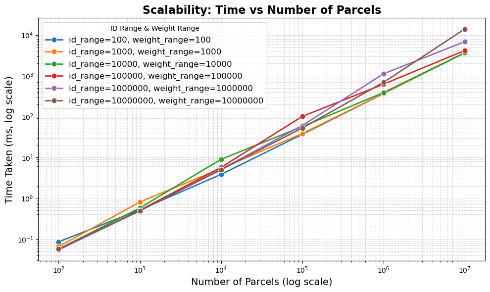 | 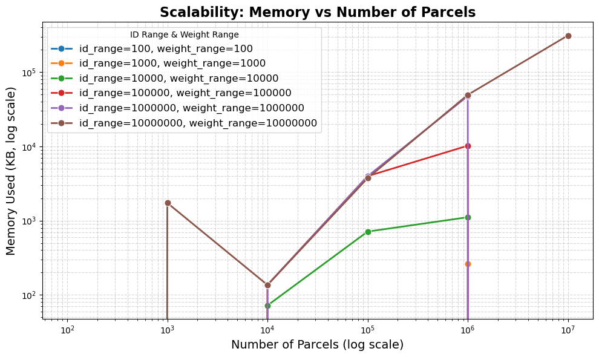 |

---

## Problem 2: Binary Conveyor Network

### Problem Statement
We have a binary conveyor network represented as a binary tree:
- Each junction is a node that splits into two belts (left and right)
- Topmost junction (root) is numbered 0, junctions numbered in level-order traversal
- Parcels are routed to loading junctions (leaf nodes)
- We have mapping of parcels to loading junctions and list of damaged parcel IDs

**Goal:** Find the highest-numbered junction ID where all parcels in the query list were present.

### Solution Approach

1. Rebuild binary tree from given preorder and inorder traversals
2. Collect leaf node ids during tree construction and sort them
3. Create mapping from parcel id to leaf node ids where it is present
4. Use backtracking to store paths from root to each leaf node
5. For each query:
   - Perform binary search on paths to find highest junction common to all parcels
   - Search space: Path to leaf node with minimum length
   - Monotonic condition: If parcels are present at junction mid, they're present at all junctions from 0 to mid

### Reasoning
The goal is to find the highest numbered common node in paths to all parcels in the query. This creates a binary search space where nodes from 0 to the answer are True, and nodes after are False.

### Complexity Analysis

Let:
- N = Number of nodes in tree
- h = Height of tree
- n = Number of leaf nodes
- k = Number of queries
- q = Number of parcels per query

**Time Complexity:**
- Rebuilding tree: O(N)
- Creating mappings: O(n·m)
- Backtracking paths: O(N)
- Query processing: O(k·q·log h)
- **Overall:** O(N + n·m + k·q·log h)

**Space Complexity:**
- Tree storage: O(N)
- Parcel to leaf mapping: O(p)
- Paths storage: O(n·h)
- **Overall:** O(N + p + n·h)

### Experimental Setup
- **Leaf nodes (n):** [10², 10³, 10⁴, 10⁵, 10⁶]
- **Parcels per leaf (m):** 1 to 100 (uniform)
- **Queries (k):** [10², 10³, 10⁴, 10⁵]
- **Parcels per query (q):** 1 to 100 (uniform)

### Empirical Observations
| *Figure 3: Time vs Number of Leaf Nodes* | *Figure 4: Space vs Number of Leaf Nodes* |
|:-----------------------------:|:-------------------------:|
| 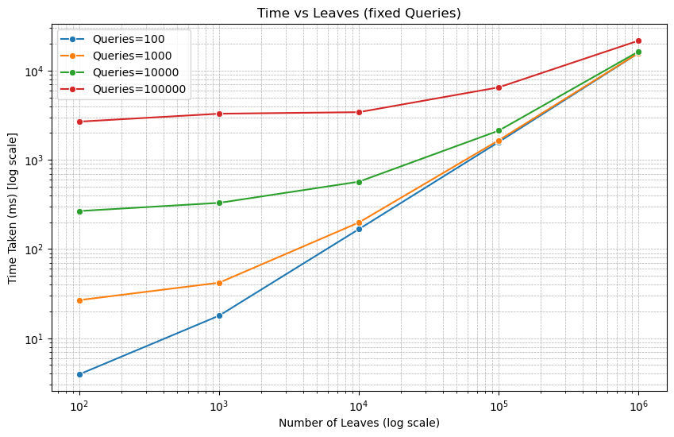 | 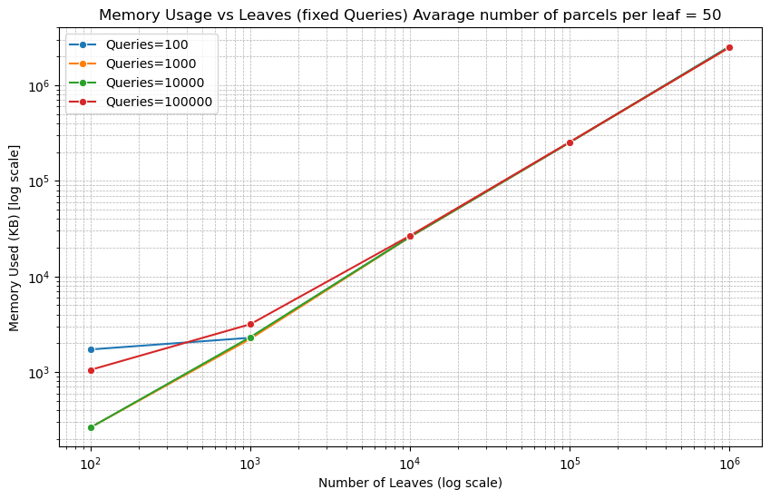 |

| *Figure 5: Time vs Number of Queries* | *Figure 6: Space vs Number of Queries* |
|:-----------------------------:|:-------------------------:|
| 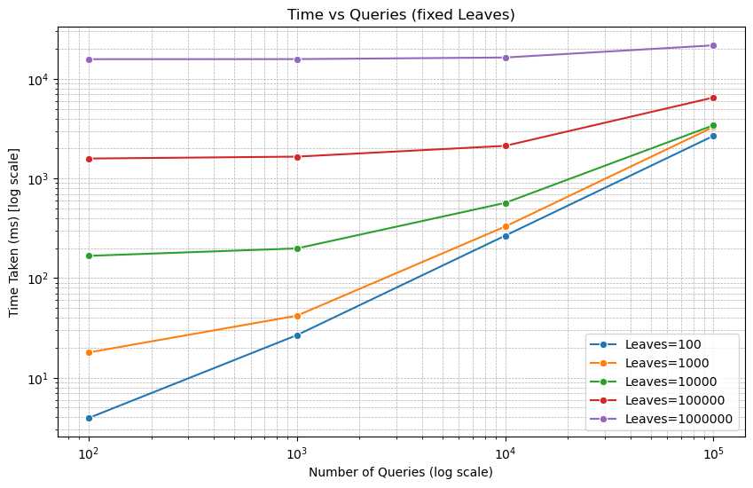 | 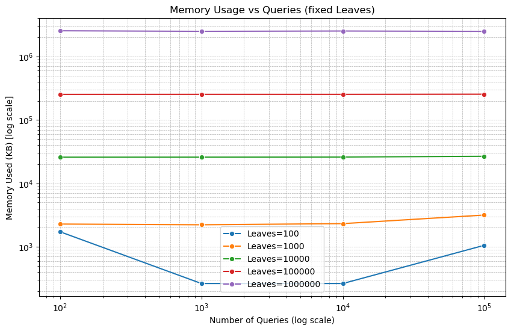 |

| *Figure 7: Time Complexity Heatmap* | *Figure 8: Space Complexity Heatmap* |
|:-----------------------------:|:-------------------------:|
| 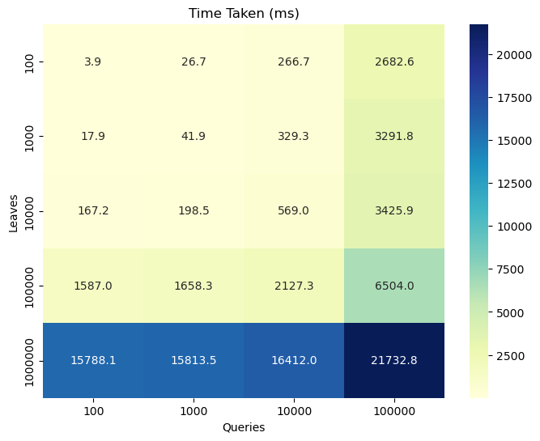 | 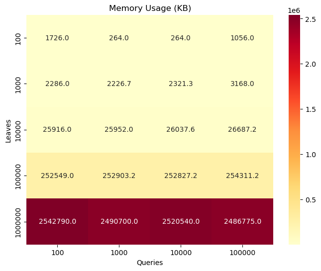 |

- Time complexity increases with leaf nodes and queries
- Space complexity increases with leaf nodes due to path storage
- Number of queries affects time but not space complexity

#### Performance Analysis

**Skewed Trees:**
| Leaves | Total Queries | Total Nodes | Time (ms) | Memory (KB) |
|--------|---------------|-------------|-----------|-------------|
| 1      | 100,000       | 100         | 380.66    | 792         |
| 1      | 100,000       | 1,000       | 365.86    | 1,056       |
| 1      | 100,000       | 10,000      | 283.34    | 2,640       |

**Complete Binary Trees:**
| Height | Queries | Leaves  | Time (ms) | Memory (KB) |
|--------|---------|---------|-----------|-------------|
| 10     | 1,000   | 512     | 15.85     | 1,056       |
| 15     | 1,000   | 16,384  | 253.16    | 36,160      |
| 20     | 1,000   | 524,288 | 7,876.69  | 1,177,530   |

---

## Problem 3: Truck Meeting Problem

### Problem Statement
We have a weighted graph representing cities (nodes) and roads (edges with travel time):
- Two trucks start from different cities (node 1 and node n)
- Can refuel at metro cities (k nodes) to double their speed
- Both trucks start simultaneously
- Refueling takes 0 time, can be done at most once per truck

**Goal:** Find earliest possible time for two trucks to meet in any city. Return -1 if they cannot meet.

### Solution Approach

1. Use DSU to check if nodes 1 and n are connected
2. Build adjacency list representation of graph
3. Convert metro cities list to set for O(1) lookup
4. Implement modified Dijkstra's algorithm tracking two states (refueled/not refueled)
5. Run Dijkstra from both starting nodes
6. For each node, calculate maximum time taken by both trucks and track minimum

### Reasoning
Paths followed by each truck don't affect each other, so we can independently find shortest times. Maintaining two states per node accounts for refueling effects on travel time.

### Complexity Analysis

Let:
- N = Number of nodes
- M = Number of edges
- K = Number of metro cities

**Time Complexity:**
- DSU operations: O(M)
- Graph building: O(M)
- Modified Dijkstra: O((N + M) log N) × 2
- Meeting point check: O(N)
- **Overall:** O((N + M) log N)

**Space Complexity:**
- Graph storage: O(N + M)
- DSU storage: O(N)
- Distance arrays: O(2N)
- Metro cities set: O(K)
- **Overall:** O(N + M)

**Best Case:** O(M) time if nodes disconnected
**Worst Case:** O(N² log N) time for dense graphs

### Experimental Setup
- **Nodes (N):** [10², 10³, 10⁴, 10⁵, 2×10⁵]
- **Graph density:** [0.1, 0.35, 0.5, 0.65, 0.7] of maximum edges
- **Metro cities:** [0.01, 0.1, 0.35] of total nodes

### Empirical Observations

| *Figure 9: Time Complexity vs Number of Nodes for Different Densities* | 
|:-----------------------------:|
| 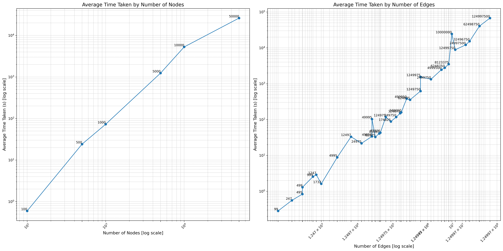 | 

| *Figure 10: Space Complexity vs Number of Nodes for Different Densities* | 
|:-----------------------------:|
| 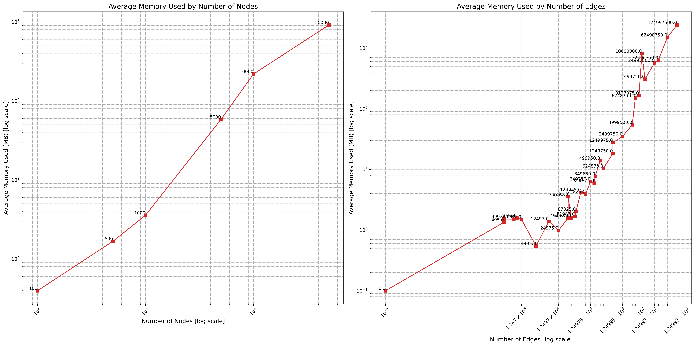 | 

| *Figure 11: Time and Space Complexity vs Number of Edges for Fixed Nodes* | 
|:-----------------------------:|
| 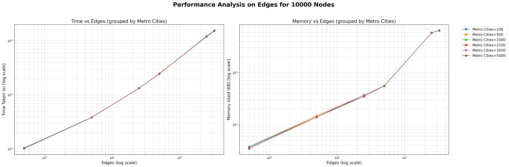 | 

| *Figure 12: Time and Space Complexity vs Number of Metro Cities for Fixed Nodes* | 
|:-----------------------------:|
| 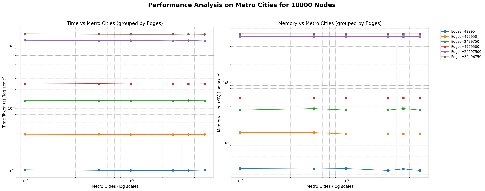 | 

- Time and space complexity increase with nodes and edges
- For fixed nodes, time increases linearly, space increases rapidly with edges
- Number of metro cities has minimal effect on performance
- Dijkstra performs O(N log N) for sparse graphs, O(N² log N) for dense graphs

